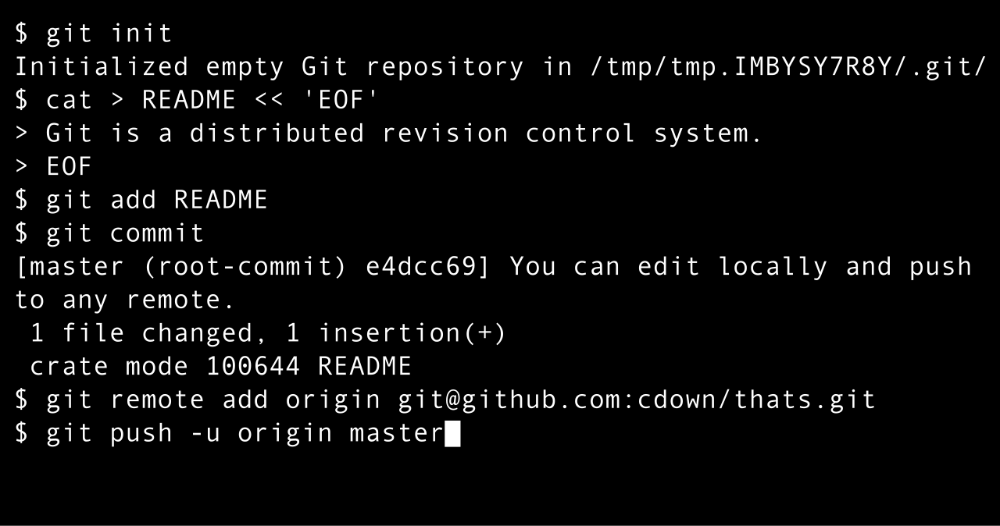

Here’s a list of the most important Git commands you should know, using the latest Git version (as of Git 2.23+).

These commands cover most of the day-to-day tasks you'll encounter when working with Git repositories.

## 1. Setting Up Git

Set your username:

```bash
git config --global user.name "Your Name"
```

Set your email:

```bash
git config --global user.email "your.email@example.com"
```

Check your configuration:

```bash
git config --list
```

## 2. Repository Basics

Initialize a new repository:

```bash
git init
```

Clone an existing repository:

```bash
git clone <repository-url>
```

## 3. Checking Repository Status

Check the status of your repository:

```bash
git status
```

## 4. Working with Files

Track a new file:

```bash
git add <file-name>
```

Track all changes:

```bash
git add .
```

Unstage a file:

```bash
git restore --staged <file-name>
```

Discard changes in a file (unstaged):

```bash
git restore <file-name>
```

## 5. Checking Repository Status

Check the status of your repository:

```bash
git status
```

Commit staged changes:

```bash
git commit -m "Your commit message"
```

Amend the last commit (e.g., to fix the message):

```bash
git commit --amend
```

## 6. Branching

Create and switch to a new branch:

```bash
git switch -c <branch-name>
```

Switch to an existing branch:

```bash
git switch <branch-name>
```

List all branches:

```bash
git branch
```

Delete a local branch:

```bash
git branch -d <branch-name>
```

Force delete a local branch:

```bash
git branch -D <branch-name>
```

## 7. Merging

Merge a branch into the current branch:

```bash
git merge <branch-name>
```

Abort a merge (if there are conflicts):

```bash
git merge --abort
```

## 8. Working with Remote Repositories

Add a remote repository:

```bash
git remote add origin <repository-url>
```

List remote repositories:

```bash
git remote -v
```

Push changes to the remote repository:

```bash
git push origin <branch-name>
```

Pull changes from the remote repository:

```bash
git pull origin <branch-name>
```

Fetch changes from the remote repository (without merging):

```bash
git fetch origin
```

## 9. Viewing History

View commit history:

```bash
git log
```

View a simplified commit history:

```bash
git log --oneline
```

View changes in the working directory:

```bash
git diff
```

View changes in staged files:

```bash
git diff --staged
```

## 10. Undoing Changes

Undo unstaged changes in a file:

```bash
git restore <file-name>
```

Unstage changes:

```bash
git restore --staged <file-name>
```

Undo the last commit (keep changes):

```bash
git reset --soft HEAD~1
```

Undo the last commit (discard changes):

```bash
git reset --hard HEAD~1
```

Revert a specific commit:

```bash
git revert <commit-hash>
```

## 11. Tagging

Create a tag:

```bash
git tag <tag-name>
```

Push a tag to the remote repository:

```bash
git push origin <tag-name>
```

List all tags:

```bash
git tag
```

## 12. Cleaning Up

Remove untracked files:

```bash
git clean -f
```

Remove untracked files and directories:

```bash
git clean -fd
```

## 13. Collaboration

Rebase your branch onto another branch:

```bash
git rebase <branch-name>
```

Stash your changes:

```bash
git stash
```

Apply stashed changes:

```bash
git stash apply
```

List stashes:

```bash
git stash list
```

## 14. Deleting Remote Branches

Delete a branch from the remote repository:

```bash
git push origin --delete <branch-name>
```

## 15. Checking Help

Get help for a Git command:

```bash
git help <command>
```
