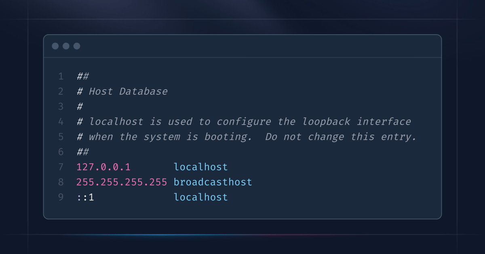

The `hosts` file on macOS is a powerful tool for mapping domain names to specific IP addresses. Whether you're redirecting domains for local development, blocking unwanted sites, or testing server configurations, editing the `hosts` file is a straightforward process.

## 1. Open the Terminal

You can find Terminal in `Applications > Utilities > Terminal`, or just search for it using Spotlight `Cmd + Space`

## 2. Launch Nano with Sudo

Since the hosts file requires root permissions to edit, use `sudo` to run `nano`. Type the following command and press Enter:

```bash
sudo nano /etc/hosts
```

## 3. Edit the Hosts File

Once `nano` opens, you'll see the contents of the `/etc/hosts` file. It typically looks something like this:

```bash
##
# Host Database
#
# localhost is used to configure the loopback interface
# when the system is booting.  Do not change this entry.
##
127.0.0.1       localhost
255.255.255.255 broadcasthost
::1             localhost
```

- Use the arrow keys to move the cursor to the end of the file.
- Add your new entry on a new line. The format is:

```bash
IP_ADDRESS    HOSTNAME
```

For example, to map `example.com` to `127.0.0.1`, add:

```bash
127.0.0.1    example.com
```

You can add multiple hostnames on the same line, separated by spaces:

```bash
127.0.0.1    example.com www.example.com
```

## 4. Save and Exit Nano

- To save your changes, press `Ctrl + O` (Write Out), then press Enter to confirm the filename `/etc/hosts`.
- To exit `nano`, press `Ctrl + X`.

## 5. Flush the DNS Cache (Optional)

After editing the hosts file, macOS might not immediately recognize the changes because of DNS caching. To apply the changes, flush the DNS cache by running:

```bash
sudo dscacheutil -flushcache; sudo killall -HUP mDNSResponder
```

This command clears the cache and restarts the DNS responder.

## 6. Verify the Changes

To ensure your entry works, test it with a `ping` command

```bash
ping example.com
```

If the entry was added correctly (e.g., mapping to `127.0.0.1`), you should see responses from that IP address.

## Notes and Tips

- **Be Careful**: Incorrect changes to the hosts file can cause network issues. Always double-check your entries.
- **Back Up (Optional)**: Before editing, you can back up the hosts file by copying it:

```bash
sudo cp /etc/hosts /etc/hosts.bak
```

- **Permissions**: If you see "permission denied" even with `sudo`, check if your user has admin rights.
- **Format**: Make sure there's at least one tab or space between the IP and hostname. Don’t use spaces in hostnames.
