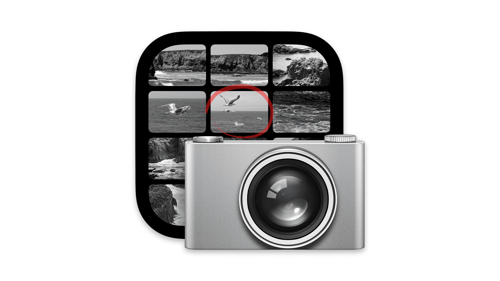
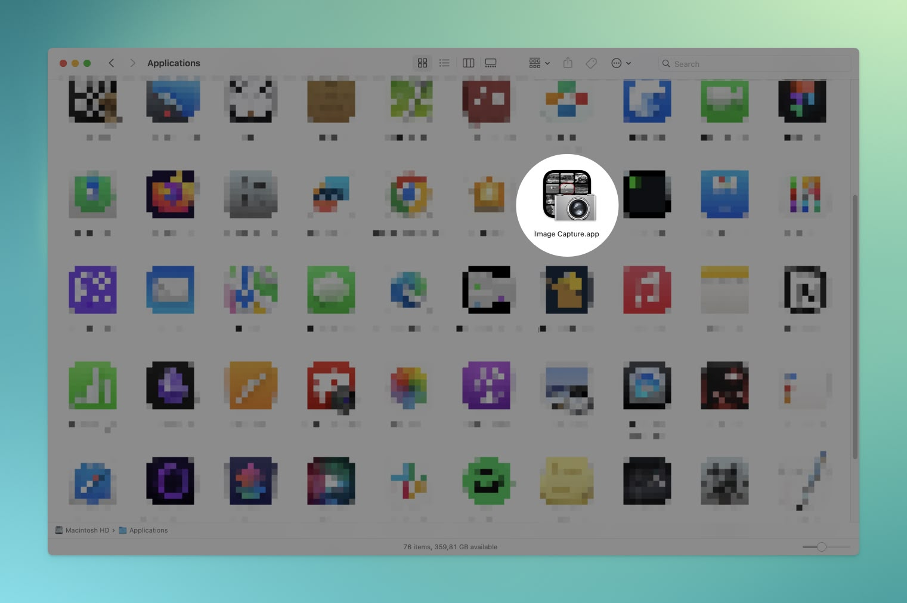

In this step-by-step tutorial, I’ll show you how to use the built-in Image Capture app on your Mac to scan and combine multiple documents into a single PDF file.

This method eliminates the need for third-party apps and streamlines your scanning process, making it smoother and more efficient.

## Step 1: Open Image Capture app

Open Launchpad or navigate to your Applications folder and locate the Image Capture app.

## Step 2: Select scanner

1. Select your scanner.
2. Click the Show Details button. This provides an overview of what your scan will look like, allowing you to preview before scanning the actual document.

## Step 3: Adjust scanning settings

1. The right-hand panel allows you to adjust your scan settings
2. When you’re done adjusting your settings, click the Scan button

**Kind:** Choose between color or black and white.

**Resolution:** Determines scan quality—higher values means better quality but also increase file size.

**Size:** Leave as auto or select a standard paper size, e.g., A4.

**Orientation:** Automatically detects document orientation, but manual adjustments are possible.

**Scan To:** Choose where your scan will be saved.

**Name:** Specify the filename of your scanned document.

**Format:** Choose the desired image format, such as .jpeg, .png, or .pdf for documents.

**Combine into single document:** Make sure to check it—it’s the key step to get all your scans into one file.

## Step 4: Pop-up window

1. A pop-up window will appear, displaying your scanned document; leave it open as you place your next document in the scanner.
2. Click the Scan button again to scan your next document. Repeat this process for multiple pages.

## Step 5: Save your document

All done! Navigate to your save location and open the PDF.

You’ll find all your documents combined into a single file.

